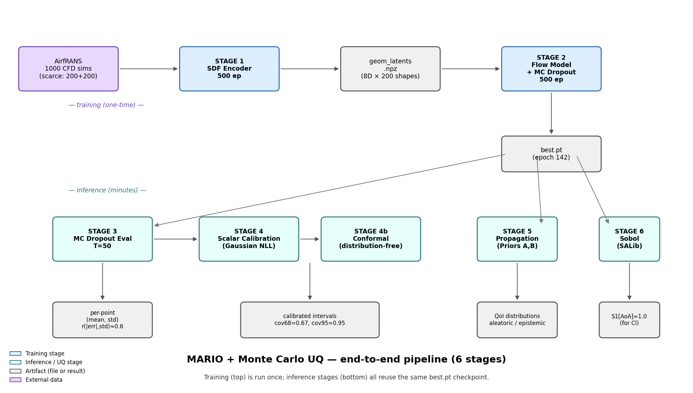
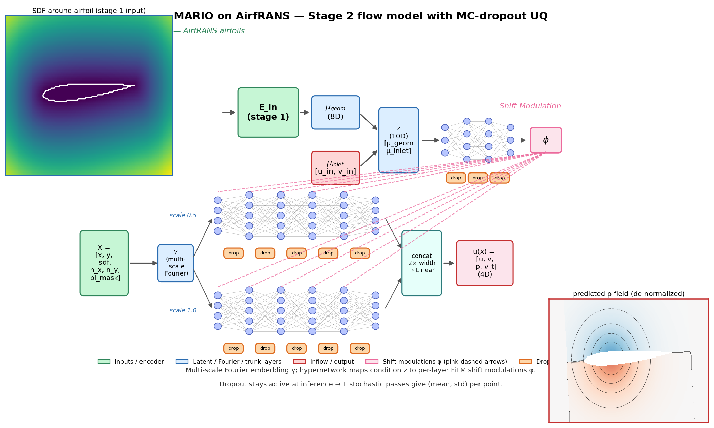
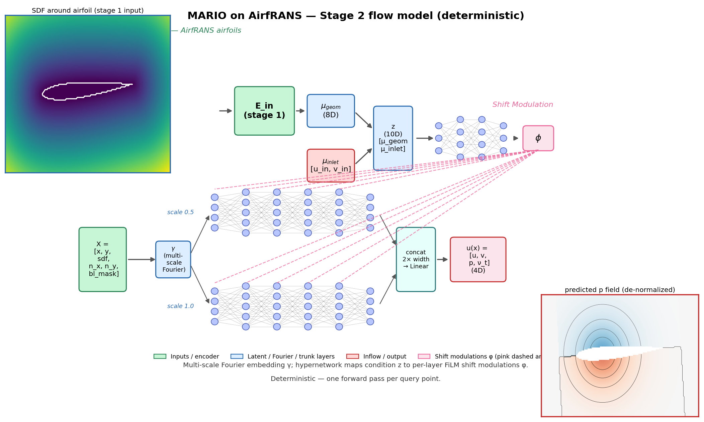
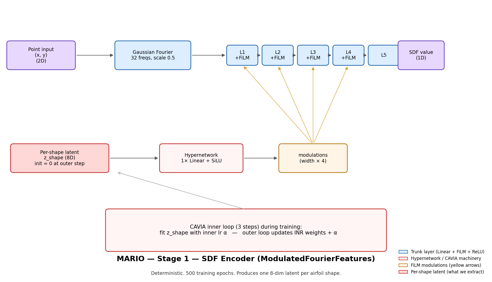
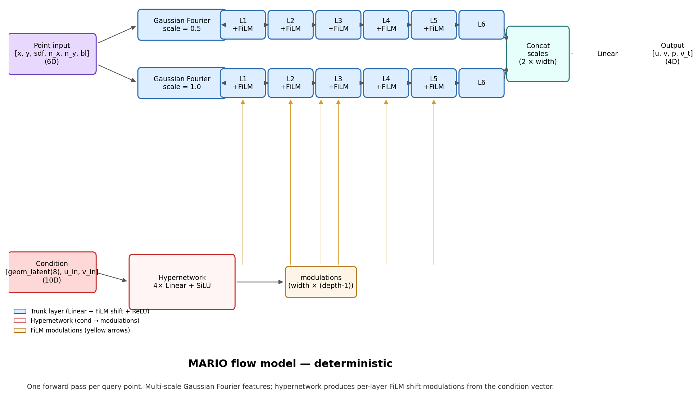
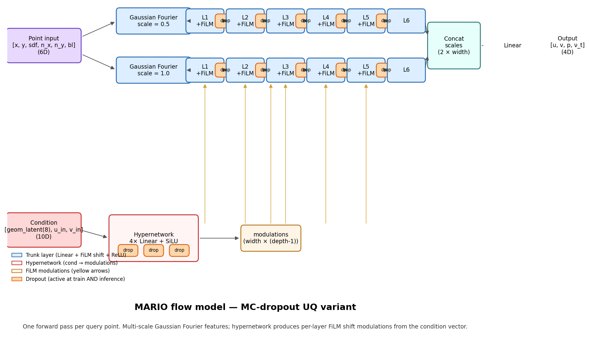
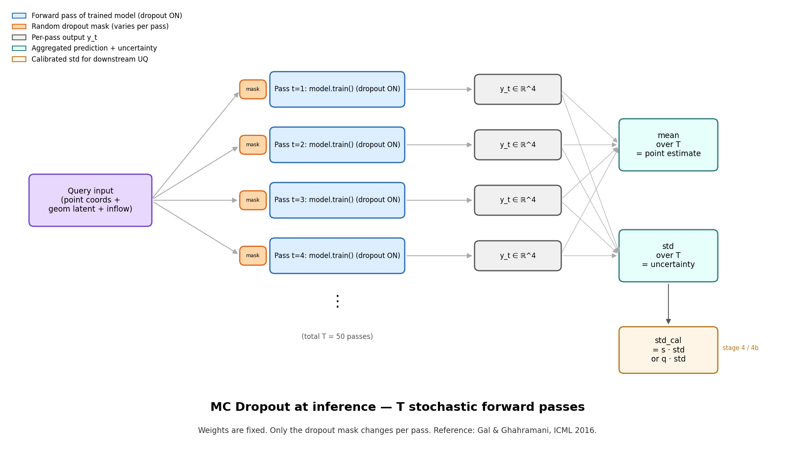

# MARIO + Monte Carlo UQ — `airfrans_task/uq/`

Uncertainty quantification layer added on top of the MARIO conditional
neural field surrogate for the AirfRANS incompressible-RANS dataset.
Six MC-based UQ stages, all tier-1 methods, honest numbers end to end.

**Detailed writeup with methods, rationale, references and figures:
[REPORT.md](REPORT.md).**

## Pipeline at a glance



One training pass through stages 1 & 2 produces `best.pt`. The four
inference stages (3, 4/4b, 5, 6) all reuse that same checkpoint.

## What this folder contains

### Code (tracked in git)

| File | Role |
|---|---|
| `models_uq.py` | Copy of MARIO's flow model (`MultiScaleModulatedFourierFeatures`) with dropout in the hypernetwork and FiLM trunk — the MC-dropout backbone. |
| `train_sdf.py` | Copy of upstream Stage 1 (SDF encoder) with the torch-2.13 `verbose=True` fix, per-epoch stdout logging and loss.png. |
| `train_uq.py` | Stage 2 trainer: carved 160/40 train/val split from AirfRANS train, offline wandb, every-50-epoch checkpoints + best + last. |
| `evaluate_uq.py` | Stage 3: `T=50` MC-dropout passes on test, per-field RMSE / coverage / Pearson r(\|err\|, std). |
| `calibrate.py` | Stage 4: scalar NLL calibration (closed-form MLE per field) with reliability plot. |
| `conformal.py` | Stage 4b: split conformal prediction with normalized nonconformity scores. |
| `propagate.py` | Stage 5: Monte Carlo inflow propagation under two priors, with aleatoric/epistemic decomposition and Cl/Cd integrals. |
| `sensitivity.py` | Stage 6: Saltelli sampling + Sobol first-order and total-order indices via SALib. |
| `extract_modulations.py` | Standalone recovery tool for Stage 1 modulation extraction when the upstream `train_sdf.py` hangs. |
| `make_architecture_fig.py` | Regenerates the architecture diagrams in `figures/`. |
| `config_uq.yaml` | Hydra config for `train_uq.py`. |

### Documentation (local-only, excluded via `.git/info/exclude`)

| File | Role |
|---|---|
| [REPORT.md](REPORT.md) | Full detailed report — methods, rationale, citations, every stage's figures and results. |
| [WORKFLOW.md](WORKFLOW.md) | Operational playbook: run order, portability rules, data leakage rules. |
| [COLAB.md](COLAB.md) | How to run the pipeline in the browser or VSCode via Google Colab. |
| `figures/` | All figures referenced by REPORT.md (reused from training runs + two architecture diagrams). |

## Architecture at a glance

MARIO is a **conditional neural field (INR)** — not a GNN. Each query
point `(x, y)` is predicted independently from its position, local
geometry features (SDF, normals, boundary-layer mask) and a per-sim
condition vector (geometry latent + mean inlet velocity).

Two stages:

- **Stage 1 — SDF encoder**: a modulated Fourier-features INR trained
  via CAVIA-style meta-learning (3 inner gradient steps per sim). Fits
  one 8-dim latent per airfoil shape. Deterministic.
- **Stage 2 — flow model**: a multi-scale Fourier-features INR with a
  hypernetwork that maps the condition vector into per-layer FiLM
  shift modulations. Our UQ variant adds dropout in the hypernetwork
  AND the FiLM trunk, kept active at inference for Monte Carlo UQ.

Paper-style schematic (our AirfRANS problem, UQ variant) — SDF input,
encoder → μ_geom, inflow condition, hypernetwork drawn as neurons,
multi-scale FiLM trunk, output pressure field, dropout blocks in orange:



Same figure for the deterministic variant (no dropout):



Block-style diagrams (same architecture, cleaner layout for quick reference):

Stage 1 — SDF encoder (deterministic, meta-learned):



Stage 2 — flow model, deterministic variant:



Stage 2 — flow model, MC-dropout UQ variant (dropout blocks in orange):



MC dropout at inference — how T stochastic passes produce (mean, std):



Regenerate all five diagrams with:
```
python airfrans_task/uq/make_architecture_fig.py --all
```

## The six (seven) stages at a glance

| # | What | Reference |
|---|---|---|
| 1 | SDF encoder → per-shape latents | upstream MARIO (Catalani 2025) |
| 2 | Flow-model training with MC dropout | Gal & Ghahramani (ICML 2016) |
| 3 | MC-dropout evaluation on test | Gal & Ghahramani (ICML 2016) |
| 4 | Scalar variance calibration | Levi et al. (2022) |
| 4b | Split conformal prediction | Vovk 2005; Angelopoulos & Bates (2023) |
| 5 | Monte Carlo propagation + aleatoric/epistemic | Rubinstein & Kroese 2016; Kendall & Gal (NeurIPS 2017) |
| 6 | Sobol global sensitivity | Saltelli et al. (2008); Herman & Usher (JOSS 2017) |

## Headline results

- MC dropout gave **r(\|err\|, std) = 0.55–0.66** across all four
  output fields — strong predictive-uncertainty signal.
- Scalar calibration restored **cov95 = 0.95 exactly** on test but
  left 0.73 at the 68% target (non-Gaussian tails).
- Conformal prediction hit **cov68 = 0.67 and cov95 = 0.95** with
  intervals 11–24 % narrower than the Gaussian-scaled baseline.
- Variance decomposition: **aleatoric (inflow) dominates (85–100 %)**;
  epistemic (model) is a measurable 10–15 % on pressure QoIs under
  tight sensor-noise conditions, swamped under broad envelopes.
- Sobol: **AoA explains 74–100 %** of pressure-QoI variance; airspeed
  explains ≤ 25 %. Lift coefficient matches thin-airfoil theory
  (`Cl ≈ 2π·AoA`, independent of U).

See [REPORT.md](REPORT.md) for the full story with figures and the
rationale behind every design decision.

## Running the pipeline

Environment: conda env `gnn_surrogate` with `airfrans`, `pyoche`,
`hydra-core`, `omegaconf`, `wandb`, `SALib`, `torch_geometric`, `yaml`.

```bash
# From repo root. Set once per shell:
export WANDB_MODE=offline

# Stage 1 — SDF encoder (~2 h on RTX 2060)
cd airfrans_task
python uq/train_sdf.py \
    dataset.root_path=<path>/Dataset \
    output_dir=<repo>/airfrans_task \
    optim.epochs=500

# Stage 2 — Flow model (~2 h on RTX 2060)
python uq/train_uq.py \
    dataset.root_path=<path>/Dataset \
    dataset.train_latents_path=<stage1>/modulations/scarce_train_8.npz \
    dataset.test_latents_path=<stage1>/modulations/scarce_test_8.npz \
    optim.epochs=500 inr.dropout_hnn=0.05 inr.dropout_trunk=0.05

# Stages 3–6 (all inference, minutes)
python uq/evaluate_uq.py  --run-dir <stage2_run> --root-path <path>/Dataset --split test --T 50
python uq/calibrate.py    --run-dir <stage2_run> --root-path <path>/Dataset --T 50
python uq/conformal.py    --calibration-pt <stage2_run>/results/calibration_T50_*.pt
python uq/propagate.py    --run-dir <stage2_run> --root-path <path>/Dataset --n-geom 20 --n-draws 500 --T 10 --num-points 10000
python uq/sensitivity.py  --run-dir <stage2_run> --root-path <path>/Dataset --n-geom 5 --N 256 --T 5 --num-points 10000
```

## Smoke tests

Every file has a matching synthetic-data smoke test under
`tests/`. Run before any real pipeline change:

```bash
python tests/test_pipeline.py
python tests/test_full_pipeline.py
python tests/test_models_uq.py
python tests/test_train_uq.py
python tests/test_calibrate.py
python tests/test_conformal.py
python tests/test_propagate.py
python tests/test_sensitivity.py
```

All eight should end with `ALL OK` in under a minute total on CPU.

## Hard rules

- **Never edit original repo files.** `src/*.py` and
  `airfrans_task/{train.py, train_sdf.py, dataset.py, evaluate.py,
  config_*.yaml}` are upstream. Any change goes in `uq/` as a copy or
  new file.
- **Test set is for reporting only.** Nothing is fit on it. The 40-sim
  val split carved from AirfRANS train is used for calibration and
  conformal quantile fitting.
- All UQ code is device-agnostic (`cuda` if available, else CPU) and
  checkpoints load with `map_location=device`.
