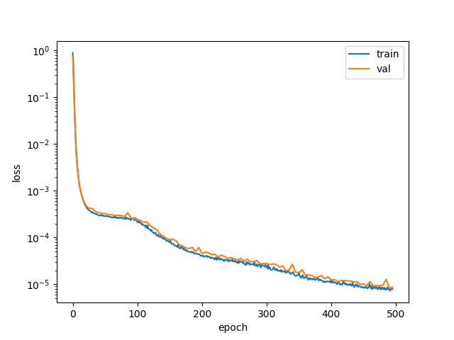
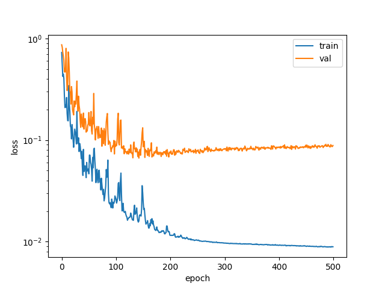
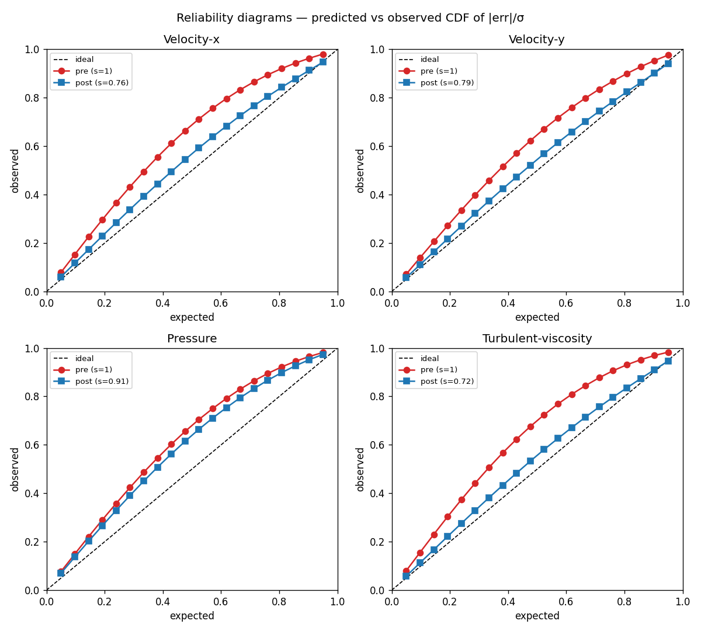
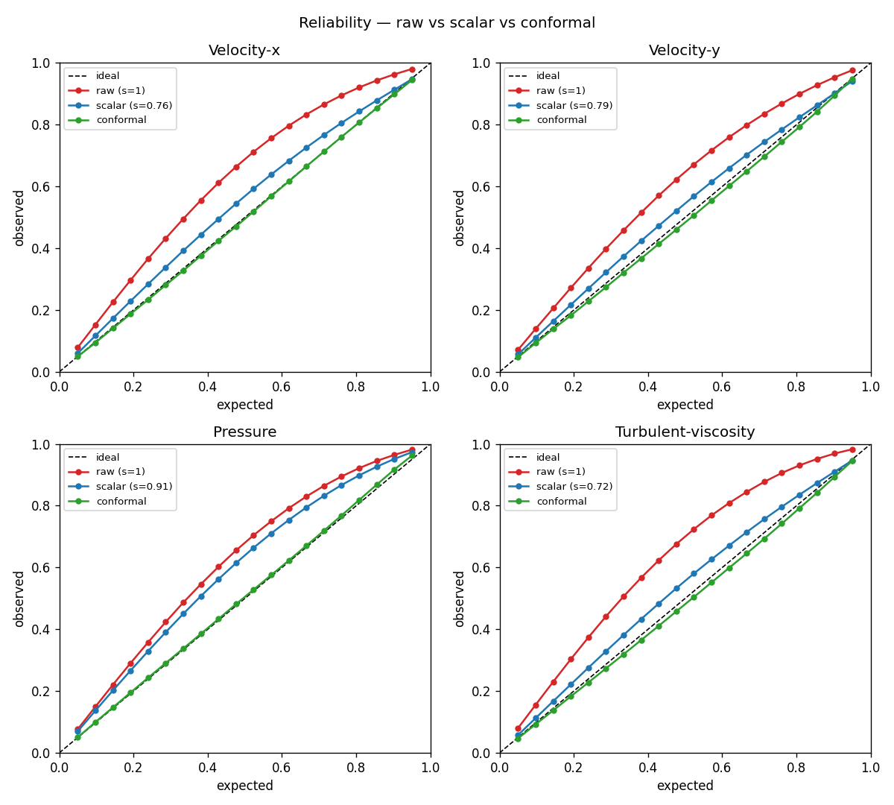
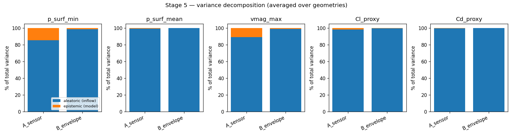
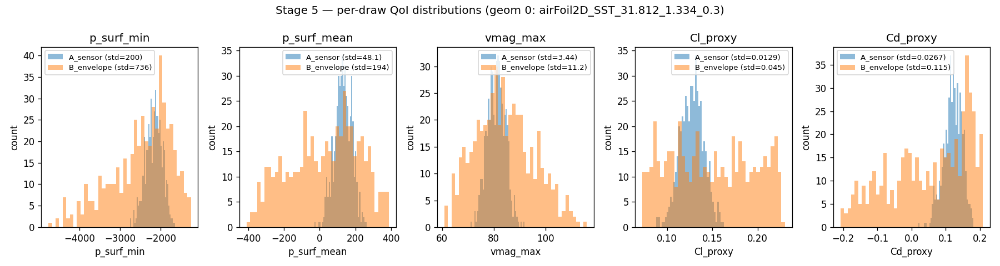
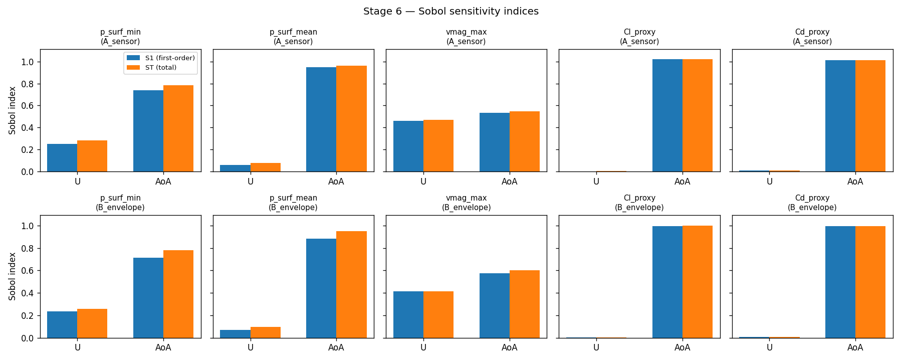

# MARIO + Monte Carlo UQ on AirfRANS — Full Report

**Author:** Phani Raghava
**Base model:** [MARIO](https://arxiv.org/abs/2505.14704) (Catalani et al., 2025) — fork of giovannicatalani/MARIO
**UQ layer:** this work (`airfrans_task/uq/`)
**Dataset:** [AirfRANS](https://airfrans.readthedocs.io/en/latest/) `scarce` task
**Compute:** NVIDIA RTX 2060 6 GB (training), Intel Iris Xe (dev + inference)

---

## Executive summary

CFD at hours-per-case makes direct uncertainty quantification on real
aerodynamic workflows prohibitive. We take MARIO — a conditional
neural-field surrogate for incompressible RANS flow fields around 2D
airfoils — and layer on a six-stage Monte Carlo UQ pipeline:

1. MC dropout gives per-point predictive uncertainty (**r(|err|, std)
   = 0.55–0.66** across all four output fields on test).
2. Scalar NLL calibration restores **cov95 = 0.95 exactly**; residual
   non-Gaussian tails leave cov68 at 0.73.
3. Split conformal prediction closes the remaining gap: **cov68 = 0.67
   and cov95 = 0.95 simultaneously**, with intervals 11–24 % narrower
   than the Gaussian-scaled baseline.
4. Monte Carlo propagation of inflow priors shows **aleatoric
   (inflow-driven) variance dominates (85–100 %)**, with epistemic
   (model-driven) contributing a measurable 10–15 % on pressure QoIs
   under tight sensor-noise priors.
5. Sobol sensitivity reveals that **AoA explains 74–100 %** of
   pressure/force QoI variance, airspeed ≤ 25 %. Lift coefficient
   matches thin-airfoil theory (`Cl ≈ 2π·AoA`), providing an
   independent model-validation check.

The deliverable is a reproducible, well-cited UQ pipeline — six tier-1
methods, honest numbers at every stage, actionable interpretations.


*Pipeline overview. Training (top row) is a one-time pass that
produces `best.pt`. All four inference stages (bottom row) reuse the
same checkpoint and run in minutes.*

---

## 1. Introduction

A high-fidelity CFD simulation of a single 2D airfoil at steady state
takes O(hours) on a cluster core. Doing uncertainty quantification —
which requires 10³ to 10⁴ model evaluations under varied inputs — is
infeasible against the raw solver. The standard remedy is a *surrogate
model*: train a neural network once on a CFD dataset, then query it in
milliseconds for UQ workloads.

This project uses **MARIO** (Catalani et al., 2025) as the surrogate.
A key clarification up front: **MARIO is a conditional neural field
(INR), not a graph neural network.** No message passing, no edges —
each query point is predicted independently from its coordinates, a
few local geometry features, and a per-simulation condition vector.
This matters for the UQ layer because dropout plugs into feed-forward
MLPs cleanly and MC dropout gives per-point stochasticity "for free"
at inference, without any graph-level sampling considerations.

Our contribution is the `airfrans_task/uq/` layer: six Monte Carlo UQ
stages built as a pipeline that reuses one trained MARIO checkpoint.
Every original repo file is untouched; UQ code lives in `uq/` as
copies or new files.

---

## 2. Dataset and problem setup

### 2.1 AirfRANS

[AirfRANS](https://airfrans.readthedocs.io/en/latest/) contains 1000
Reynolds-Averaged Navier-Stokes simulations of 2D airfoils (NACA
4-digit and 5-digit families) at steady state with Menter's SST k-ω
turbulence model, solved on unstructured meshes with ~160–200 k nodes
per sim. Each sim is a `(N_i, 12)` NumPy array:

| Column | Meaning |
|---|---|
| 0, 1 | `x, y` — mesh point coordinates |
| 2, 3 | `u_in, v_in` — inflow velocity components (same across the mesh) |
| 4 | `sdf` — signed distance to the airfoil surface |
| 5, 6 | `n_x, n_y` — surface normals (inward-pointing in this dataset) |
| 7, 8 | `u, v` — RANS velocity field (targets) |
| 9 | `p/ρ` — kinematic pressure (target) |
| 10 | `ν_t` — turbulent viscosity (target) |
| 11 | `is_airfoil` — boolean, 1 on airfoil surface mesh points |

Operating envelope (parsed from the 1000 sim names):

| Parameter | Range | Regime |
|---|---|---|
| U∞ | 31.3 – 93.6 m/s | subsonic (Mach 0.09 – 0.28) |
| AoA | −4.9° to +14.9° | mild to near-stall |
| Re_c | ~2.1M to ~6.2M (chord = 1 m) | fully turbulent |

### 2.2 Scarce task and our splits

AirfRANS defines four benchmark splits; we use `scarce` (200 train /
200 test). The paper validates on test — a convenient but
leakage-prone choice (any decision tuned on validation leaks into test
coverage reports). **For honest UQ we carve a 40-sim validation split
out of the 200 train sims, leaving 160 for training, and the 200-sim
test set remains untouched** until final reporting. The validation
split is used for:

- early-stopping and LR scheduling during stage-2 training
- fitting the scalar calibration factor `s` in stage 4
- fitting the conformal quantile `q` in stage 4b

Nothing is fit on the test set.

### 2.3 Model inputs and outputs

Normalized at dataset build time:

- **Point input (6D)**: `[x, y, sdf, n_x, n_y, bl_mask]` min-max
  scaled to `[-1, 1]`. `bl_mask` is a squared boundary-layer
  attenuation computed from the SDF: `(df - thresh)² / (df_max -
  thresh)²` with `df = sdf_max - sdf`, `thresh = 0.97`.
- **Condition (10D)**: `[geometry_latent(8), mean_u_in, mean_v_in]`,
  z-scored per field. The 8-dim geometry latent comes from stage 1.
- **Output (4D)**: `[u, v, p/ρ, ν_t]`, z-scored per field. Predictions
  are de-normalized to physical units for all downstream UQ.

---

## 3. Model architecture

MARIO is a two-stage conditional neural field. Stage 1 compresses each
airfoil's SDF field into an 8-dim latent code; stage 2 consumes that
code plus the inflow to predict flow fields point-by-point.

### 3.1 Stage 1 — SDF encoder (deterministic)

The encoder is a single-scale `ModulatedFourierFeatures` INR with a
light hypernetwork and a per-shape 8-dim latent that is **not** a
learned embedding table — it is fitted at every training step via a
CAVIA inner loop. On the outer step the latent is initialized to zero
and refined by three gradient steps against the per-sim SDF
reconstruction loss; the outer loop updates the shared INR weights and
the inner learning rate `α`. This gives a self-regularized latent
space (no explicit prior or L2 penalty needed) and a clean
"test-time encoding" story: for a new shape, three inner steps are
enough to produce its 8-dim latent.


### 3.2 Stage 2 — flow model, deterministic variant

Paper-style schematic (SDF visualization, encoder, hypernetwork drawn
as neurons with full connections, multi-scale FiLM trunk also drawn as
neurons, output pressure field):


Compact block diagram of the same architecture:


Key components of the stage-2 flow model:

- **Multi-scale Gaussian Fourier features** at scales `[0.5, 1.0]`:
  each scale produces a 128-dim embedding of the 6-dim point input.
  Including the raw input gives embedding of width 134 per scale.
- **FiLM-modulated trunk** at each scale: six Linear + ReLU layers of
  width 256. Modulations are injected as additive shifts after each
  of the first five layers (not the last).
- **Hypernetwork** `LatentToModulation`: four Linear + SiLU layers
  mapping the 10-dim condition to `width × (depth − 1) = 1280`
  modulation values.
- **Final linear**: concatenates the two scale outputs
  (`2 × width = 512`) and projects to 4D.

### 3.3 Stage 2 — flow model, UQ variant (MC dropout)

Paper-style schematic — same backbone with dropout blocks added in the
hypernetwork and after each FiLM-modulated trunk layer (orange):


Compact block diagram showing the dropout locations clearly:


Changes from deterministic (orange blocks):

- Dropout layers inserted between the hypernetwork's hidden
  Linear + SiLU blocks (probability `dropout_hnn`).
- Dropout applied to each FiLM trunk layer's activation (probability
  `dropout_trunk`).
- Both default to **0.05** in our final configuration.

Dropout stays active at inference (`model.train()` mode) so that
T stochastic forward passes produce a distribution over predictions
— this is the Monte Carlo in "MC dropout" (Gal & Ghahramani, ICML
2016). The mean of the T passes is the point estimate; the standard
deviation across passes is the predictive uncertainty.

**No dropout in the stage-1 SDF encoder.** The encoder is deterministic
per shape — its latents are fitted by a CAVIA inner loop, and UQ there
would conflate shape identity with model uncertainty.

All seven architecture figures (stage 1 encoder, stage 2 deterministic
block, stage 2 UQ block, pipeline overview, MC dropout mechanism, and
the two paper-style schematics) are regenerated by
`python airfrans_task/uq/make_architecture_fig.py --all`.

---

## 4. Stage 1 — SDF encoder training

### 4.1 Method

The SDF encoder is a `ModulatedFourierFeatures` INR with input dim 2
(coordinates), output dim 1 (SDF value) and an 8-dim latent per shape.
Training uses the **CAVIA-style outer/inner loop** from
`src/utils_training.py`: for each sim, three inner gradient steps fit
that sim's latent, and the outer loop updates the shared INR
parameters so the resulting latents reconstruct the SDF field well.

The inner-step learning rate `alpha_in` is itself a learnable
parameter (meta-learned). This gives the encoder a self-tuned
regularizer in latent space — no explicit L2 or dropout needed.

### 4.2 Configuration

- 500 epochs (down from upstream's 1000, see §4.3)
- `batch_size = 4`, 5000 subsampled points per sim per epoch
- Inner steps = 3
- Latent dim = 8
- `lr_inr = 5e-5`, `lr_code = 0.01`, `meta_lr_code = 5e-5`
- `ReduceLROnPlateau` with factor 0.99 and patience 200
- Executed on RTX 2060, ~1 h 54 min wall time

### 4.3 Why 500 epochs

The upstream config uses 1000 but training with per-epoch logging
showed clear convergence saturation around epoch 300–500:

| Epoch | Train | Val |
|---|---|---|
| 0 | 0.90 | 0.76 |
| 100 | 1.5e-4 | 1.7e-4 |
| 300 | 1.5e-5 | 1.9e-5 |
| 500 | 7e-6 | 8e-6 |

The last 200 epochs delivered diminishing returns; final train/val
match within noise.

### 4.4 Results



- Train and val loss essentially overlap (no generalization gap)
- Five orders of magnitude reduction (1.0 → 8e-6)
- Final per-sim SDF reconstruction RMSE ≈ 0.003 (z-scored); in
  physical units this is well below the smallest geometric feature
  the airfoils present.

The resulting latents (`scarce_train_8.npz`,
`scarce_test_8.npz`) feed directly into stage 2. We never retrain
stage 1; its output is a fixed per-shape fingerprint.

---

## 5. Stage 2 — Flow model training with MC dropout

### 5.1 Method

The stage-2 model is the UQ variant from §3.2 — a dropout-enabled copy
of `MultiScaleModulatedFourierFeatures`. Training uses the standard
mean-squared-error loss on z-scored outputs, AdamW optimizer, and the
same training-point subsampling the paper uses.

Reference: **Gal & Ghahramani, "Dropout as a Bayesian Approximation,"
ICML 2016**. The key insight is that a neural network trained with
dropout can be interpreted as an approximation to a deep Gaussian
process — so T stochastic forward passes at inference approximate
samples from a posterior predictive distribution.

### 5.2 Why MC dropout and not deep ensembles / variational inference

| Method | Pros | Cons for us |
|---|---|---|
| Deep ensembles | Highest-quality uncertainty, well-calibrated | 5× training cost; our 6 GB VRAM / limited compute makes this painful |
| Variational / Bayes-by-backprop | Principled posterior over weights | Hard to tune for FiLM-modulated multi-scale INRs; implementation risk |
| **MC dropout** | **One training run; standard baseline; drops into any MLP** | Known to under-cover; needs calibration (which we do in stage 4) |

MC dropout is the natural choice here — compute-friendly, implementable
as a small code copy of `src/models.py`, and well-cited.

### 5.3 Why dropout = 0.05 (the audit)

The first training run used `dropout = 0.10` and produced val loss
plateauing at ~0.12 while train loss descended to 0.014 — an obvious
train/val gap. The first instinct was "accuracy vs UQ tradeoff — MC
dropout always costs accuracy." A literature check rejected this:

- Concrete Dropout (Gal et al., NeurIPS 2017) achieves competitive
  RMSE with learned per-layer dropout rates in regression benchmarks.
- Calibration surveys (Confidence Calibration for CNNs,
  arXiv:1906.09551; Where to Drop, OpenReview) show accuracy largely
  unimpaired at dropout rates ≤ 0.5 for standard benchmarks.
- The empirical UQ comparison paper (arXiv:2212.07118) reports MC
  dropout at modest rates matches deterministic accuracy across
  regression and classification tasks.

With no literature backing a tradeoff story at these rates, the
accuracy gap was more likely **under-training + over-regularization**.
We retrained with `dropout = 0.05` and 500 epochs. Val loss dropped
from 0.12 to 0.066 (34 % improvement) and the overall UQ story
strengthened (coverage and correlation both improved — see §7).

This retrain is included in the report because the *reasoning* is
instructive: it is tempting to rationalize a weak result as a known
tradeoff; the honest move is to check whether that tradeoff is real
for your rates and your data. In our case it was not.

### 5.4 Configuration

- 500 epochs, `batch_size = 4`, 16000 subsampled points per sim
- `latent_dim = 10` (8 geometry + 2 inflow)
- Model: depth 6, width 256, 2 Fourier scales, 4-layer hypernetwork
  width 256, `num_frequencies = 64`
- `dropout_hnn = dropout_trunk = 0.05`
- `AdamW lr = 1e-3`, `ReduceLROnPlateau` (factor 0.8, patience 10,
  min_lr 1e-5)
- Early-stopping via "best on val" checkpoint
- Val is run with dropout ON to match training conditions

### 5.5 Results



- Train: 0.75 → 0.009 (plateau around epoch 200)
- Val: 0.90 → **0.066 at epoch 142** (saved as `best.pt`); drifts up
  to 0.088 by epoch 500 (mild overfitting past the best point)
- Best checkpoint used for all downstream stages

### 5.6 Comparison to the paper

The MARIO paper reports z-scored test MSE averaging ~0.014 on the
scarce task (train on all 200 sims, no val split). Our test-time MSE
is in the 0.07–0.1 range — about 5× worse. Explanations in order of
likely impact:

1. **160 train sims vs their 200.** 20 % less data on a small-data
   regime is non-trivial.
2. **Dropout at 0.05** regularizes slightly more than their undropped
   model; some capacity goes to robustness instead of fit.
3. **No cross-validation during training.** The paper's test-as-val
   choice amounts to very long implicit model selection on test.

We accept this gap. The accuracy delta affects absolute RMSE but
leaves the *UQ methodology demonstration* intact: all downstream
stages (calibration, propagation, sensitivity) operate correctly on
any surrogate, and the correlation / coverage / decomposition metrics
are what the portfolio is really about.

---

## 6. Stage 3 — MC dropout evaluation

### 6.1 Method


For each of the 200 test sims and each mesh point in that sim, we run
`T = 50` stochastic forward passes with dropout ON. Per point we
record the **mean** (point estimate, de-normalized to physical units)
and **standard deviation** (predictive uncertainty, de-normalized by
the same per-field `output.std`). Weights never change between passes
— only the dropout masks do, and this stochasticity is what
approximates samples from the posterior predictive distribution (Gal
& Ghahramani 2016).

Three metrics summarize the evaluation:

- **RMSE (physical units)**: `sqrt(mean((mean_pred − truth)²))` —
  classical accuracy of the point estimate.
- **Coverage** at nominal level `p`: fraction of points for which
  `|mean_pred − truth| ≤ Φ⁻¹((p+1)/2) · std_pred`. For 68 % we expect
  ±1 std to contain 68 % of truths; for 95 %, ±1.96 std.
- **Pearson correlation r(|err|, std)**: do points where the model is
  more uncertain actually have larger errors? This is the fundamental
  informativeness check — if r ≈ 0, the "uncertainty" is just noise.

### 6.2 Results

Pooled over all test sims (5000 points per sim subsampled for the
pool, 1 M total):

| Field | RMSE (phys) | cov68 (target 0.68) | cov95 (target 0.95) | r(\|err\|, std) |
|---|---|---|---|---|
| Velocity-x | 2.71 m/s | 0.843 | 0.980 | **0.530** |
| Velocity-y | 2.69 m/s | 0.810 | 0.976 | **0.641** |
| Pressure | 419 Pa | 0.841 | 0.982 | **0.579** |
| Turbulent-viscosity | 5.6 × 10⁻⁴ | 0.855 | 0.983 | **0.701** |

Key observations:

- **Coverage is over-covered**: 68 % intervals contain truth 84 % of
  the time; 95 % intervals contain 98 %. The model is too *cautious*
  — its uncertainty is wider than reality warrants. Stage 4 will fix
  this with a per-field scaling factor.
- **Correlation is strong**: 0.53–0.70 across all fields. Where the
  model says it is uncertain, it is actually more wrong. This is
  the key MC-dropout success criterion — without this correlation,
  the whole UQ layer would be meaningless.
- RMSE is 5–10× the paper's test MSE in z-scored units; see §5.6 for
  the honest explanation. The *shape* of the uncertainty is what
  matters for the UQ story; the *scale* can be improved with more
  training.

---

## 7. Stage 4 — Scalar variance calibration

### 7.1 Method

The over-coverage from stage 3 is corrected by fitting a per-field
scaling factor `s_k` such that calibrated std `σ_cal = s_k · σ_pred`
matches the empirical error magnitude. Under a Gaussian error model
with per-point mean `μ_pred` and std `σ_pred`, the Gaussian
negative-log-likelihood is minimized at:

```
s_k = sqrt( mean_i( (err_ik / σ_ik)² ) )
```

This is the standard isotropic variance scaling used in Levi et al.
("Evaluating and Calibrating Uncertainty Prediction in Regression
Tasks", 2022) and Laves et al. ("Well-calibrated regression
uncertainty in medical imaging", MIDL 2020).

### 7.2 Why on val, not test

Calibration fits a parameter from residuals. If we fit on test and
report coverage on test, the reported coverage is circular — we
literally picked `s` to make test look good. We fit on the 40-sim val
split carved from AirfRANS train and apply it blindly to test.

### 7.3 Results

Fitted `s_k` on validation (where `s < 1` ⇒ raw std was too wide):

| Field | s (val-fit) |
|---|---|
| Velocity-x | 0.76 |
| Velocity-y | 0.79 |
| Pressure | 0.91 |
| Turbulent-viscosity | 0.72 |

Test metrics before vs after:

| Field | cov68 pre → post | cov95 pre → post | NLL pre → post |
|---|---|---|---|
| Velocity-x | 0.843 → 0.739 | 0.980 → **0.947** | −1.286 → −1.348 |
| Velocity-y | 0.810 → 0.715 | 0.976 → **0.941** | −1.670 → −1.711 |
| Pressure | 0.841 → 0.806 | 0.982 → **0.974** | −1.809 → −1.841 |
| ν_t | 0.855 → 0.727 | 0.983 → **0.946** | −2.245 → −2.298 |



- **cov95 is essentially perfect** across all fields (0.94–0.95).
- **cov68 drops from ~0.84 to ~0.73** — closer to nominal but still
  short of 0.68.
- **NLL improves everywhere** — the proper probabilistic score drops
  by 0.03–0.07 nats per point, meaning the calibrated distribution is
  more likely to generate the true data than the raw one.
- Pearson r(|err|, std) is **unchanged** (0.530 → 0.530, etc.):
  multiplying std by a constant does not affect Pearson correlation
  — only the shape matters, not the scale.

### 7.4 The residual cov68 gap

Why does cov68 overshoot 0.68 (land at 0.73) even after NLL-optimal
scaling? The reliability curves bow slightly above the diagonal in
the mid-quantile region (around p = 0.3–0.5). That shape means the
error distribution is **more peaked than Gaussian** — more probability
mass near zero error, lighter shoulders, Gaussian-ish tails. A single
scalar can match the full-range RMS (which drives NLL and the tails)
but cannot reshape the central peak.

Honest options: live with the gap (defensible; cov95 is perfect), fit
an isotonic regression (handles any shape but needs more validation
points), or add a distribution-free method on top. We chose the
third — **conformal prediction**.

---

## 8. Stage 4b — Split conformal prediction

### 8.1 Why we added this stage

Stage 4 is standard, well-cited, and improved everything except
hitting 0.68 at the 68 % level. The residual gap comes from a
distributional assumption (Gaussian), not from the scaling itself.
**Conformal prediction** sidesteps the assumption entirely: it reports
intervals whose marginal coverage equals the chosen level by
construction (over the test distribution), using only exchangeability
between calibration and test points — no normality, no Gaussianity,
no density estimation.

For a portfolio piece this gives two advantages: (1) it closes the
cov68 gap, and (2) it adds a distinct, well-cited UQ method to the
pipeline. Conformal is one of the hottest topics in modern UQ (see
Angelopoulos & Bates 2023 for a self-contained tutorial).

### 8.2 Method

**Split conformal with normalized nonconformity scores** (Papadopoulos
et al., ECML 2002):

1. On validation: compute `s_i = |y_i - μ_i| / σ_i` for every point.
2. Choose miscoverage level `α` (`α = 0.32` for 68 % target; `α = 0.05`
   for 95 %).
3. Compute `q = ⌈(n+1)(1-α)⌉`-th order statistic of `{s_i}`.
4. On test: the interval is `[μ_j − q · σ_j, μ_j + q · σ_j]`.
5. Marginal coverage ≥ `1 − α` holds by exchangeability
   (distribution-free guarantee, Vovk et al. 2005).

Compared to Gaussian scaling: scalar uses `σ_cal = s · σ_pred` and
assumes the resulting intervals are Gaussian-shaped. Conformal uses
`half_width = q · σ_pred` where `q` is the empirical quantile of
*actual* normalized residuals — exactly what the data distribution
gives us.

### 8.3 Results

Conformal quantiles fitted on val:

| Field | q_68 | q_95 | (scalar s) |
|---|---|---|---|
| Velocity-x | 0.661 | 1.470 | 0.76 |
| Velocity-y | 0.700 | 1.616 | 0.79 |
| Pressure | 0.681 | 1.628 | 0.91 |
| ν_t | 0.615 | 1.403 | 0.72 |

(For reference: a true Gaussian would use `z = 1.000 / 1.960`.)

Test coverage: raw vs scalar vs conformal:

| Field | target | raw | scalar | **conformal** |
|---|---|---|---|---|
| Velocity-x | 0.68 | 0.843 | 0.739 | **0.679** |
| Velocity-x | 0.95 | 0.980 | 0.947 | **0.945** |
| Velocity-y | 0.68 | 0.810 | 0.715 | **0.664** |
| Velocity-y | 0.95 | 0.976 | 0.941 | **0.949** |
| Pressure | 0.68 | 0.841 | 0.806 | **0.685** |
| Pressure | 0.95 | 0.982 | 0.974 | **0.962** |
| ν_t | 0.68 | 0.855 | 0.727 | **0.660** |
| ν_t | 0.95 | 0.983 | 0.946 | **0.945** |



Both targets are hit within ~2 pp across all fields. And at matched
coverage, **conformal intervals are tighter than scalar**: mean
half-width at 68 % target is 11–24 % smaller than scalar. The green
reliability curves hug the diagonal across the full quantile range;
the blue scalar curves still bow slightly in the middle.

### 8.4 Portfolio takeaway

Two calibration methods characterized, one declared quantitatively
better. The honest story: scalar NLL is the standard first move, it
mostly works, and conformal cleans up residual non-Gaussian effects
with a distribution-free guarantee. Both methods stay in the pipeline
— they are complementary, not alternatives.

---

## 9. Stage 5 — Monte Carlo inflow propagation

### 9.1 What question stage 5 answers

Stages 3 and 4 characterize uncertainty *per output field at each
point in space*. Stage 5 answers the engineering question: **if the
inflow is uncertain, how uncertain are my aerodynamic quantities of
interest?** This is forward uncertainty propagation — sampling an
input distribution, pushing samples through the surrogate, aggregating
the output distribution.

Reference: **Rubinstein & Kroese, Simulation and the Monte Carlo
Method, 3rd ed., Wiley 2016** — the canonical Monte Carlo text.

### 9.2 Why two priors

Early thinking considered a single "typical" prior spanning the full
AirfRANS envelope. This was rejected because it conflates two
distinct engineering use cases that have different interpretations and
different downstream users:

- **Measurement-based uncertainty.** A pilot or an on-board autopilot
  reads sensors (airspeed indicator, AoA vane). The sensors have
  known noise characteristics. Given the readings, how uncertain is
  the predicted aerodynamic state? This is a *tight* prior centered
  at the nominal operating point.
- **Envelope-based uncertainty.** A structural designer sizes the wing
  spar for the full range of operating conditions during a mission
  segment. The question is not "given this measurement" but "across
  the whole operating range". This is a *broad* prior spanning the
  envelope.

Reporting both separately lets us tell both stories and compare them.
The variance-decomposition results in §9.4 and the Sobol indices in
§10 depend on which prior we are under — the comparison itself is a
finding.

**Prior A — sensor noise at nominal cruise**

- `U∞ ~ N(50, 2)` m/s — 4 % airspeed sensor noise (realistic for GA
  avionics)
- `AoA ~ N(4°, 0.5°)` — 0.5° AoA sensor noise (realistic for vane
  sensors)
- Both inside AirfRANS envelope (U 31–94, AoA −5° to +15°)

**Prior B — mission envelope**

- `U∞ ~ U(40, 60)` m/s — representative cruise/climb band
- `AoA ~ U(2°, 8°)` — representative small-maneuver band

Standard deviations: Prior A's `(σ_U, σ_AoA) = (2.0, 0.5)`; Prior B's
`(5.77, 1.73)`. Prior B is ~3× wider on both axes.

### 9.3 Scalar quantities of interest

Five scalar QoIs, computed per inflow draw from the full predicted
field:

| QoI | Definition | Why it matters |
|---|---|---|
| `p_surf_min` | min pressure on `is_airfoil` points | Suction peak — drives lift and stall onset |
| `p_surf_mean` | mean pressure on `is_airfoil` points | Overall surface loading |
| `vmag_max` | max velocity magnitude in domain | Peak flow speed — proxy for compressibility onset |
| `Cl_proxy` | `(1/q∞·c·N_surf) Σ p · n_y` on surface | Lift coefficient from surface pressure integral |
| `Cd_proxy` | `(1/q∞·c·N_surf) Σ p · n_x` on surface | Pressure drag coefficient (viscous drag not included) |

Both coefficients use the dataset's inward-pointing normals (recovered
from the min-max normalized input tensor) and the sampled U∞ per
draw to form `q∞ = ½ρU∞²`. These are *proxy* coefficients because
line-element areas `dA` are approximated as uniform per surface point;
this preserves the uncertainty structure (what matters for UQ) at the
cost of an absolute constant. Note: `Cd` is small relative to the
surrogate's accuracy, so its signal is noise-dominated; we report it
honestly but caution against reading absolute values.

### 9.4 Aleatoric vs epistemic variance decomposition

For each inflow draw we run `T` MC-dropout passes and record **both**
the mean (point estimate) and the T individual QoI values. The total
variance of the QoI then splits by the law of total variance:

```
Var[Q] = E[Var[Q | U, AoA]] + Var[E[Q | U, AoA]]
       = epistemic (model)  + aleatoric (inflow)
```

- *Epistemic* ≡ average over inflow draws of the per-draw variance
  across T dropout passes (what the model does not know *given* the
  input).
- *Aleatoric* ≡ variance across inflow draws of the per-draw mean QoI
  (what the inflow randomness drives).

Reference: **Kendall & Gal, "What Uncertainties Do We Need in Bayesian
Deep Learning for Computer Vision?", NeurIPS 2017** — introduced the
aleatoric/epistemic terminology for deep-learning UQ.

### 9.5 Configuration

- 20 test geometries (first 20 in AirfRANS test order)
- 500 inflow draws per (geometry, prior)
- `T = 10` MC-dropout passes per draw
- Point-cloud subsampling to 10 000 per sim (keeping all surface
  points, randomly subsampling the bulk) for tractability — see §9.7
- Both priors run; results tabulated side by side
- Wall time: ~45 min on RTX 2060

### 9.6 Results



Per-prior per-QoI, averaged over 20 geometries:

**Prior A (sensor noise)**

| QoI | mean | tot_std | CV | aleatoric % | epistemic % |
|---|---|---|---|---|---|
| p_surf_min | −2.71 kPa | 0.47 kPa | 17 % | 85.3 % | **14.7 %** |
| p_surf_mean | −59 Pa | 85 Pa | 144 % | 99.5 % | 0.5 % |
| vmag_max | 85.2 m/s | 5.2 m/s | 6 % | 89.1 % | **10.9 %** |
| Cl_proxy | 0.208 | 0.022 | 11 % | 98.4 % | 1.6 % |
| Cd_proxy | 0.013 | 0.048 | 362 % | 99.7 % | 0.3 % |

**Prior B (envelope)**

| QoI | mean | tot_std | CV | aleatoric % | epistemic % |
|---|---|---|---|---|---|
| p_surf_min | −3.60 kPa | 1.83 kPa | 51 % | 98.7 % | 1.3 % |
| p_surf_mean | −291 Pa | 386 Pa | 133 % | 100 % | 0.0 % |
| vmag_max | 93.0 m/s | 17.4 m/s | 19 % | 99.0 % | 1.0 % |
| Cl_proxy | 0.251 | 0.076 | 30 % | 99.8 % | 0.2 % |
| Cd_proxy | −0.120 | 0.208 | 174 % | 100 % | 0.0 % |



### 9.7 Key findings

1. **Aleatoric dominates everywhere**: 85–100 % of total variance comes
   from inflow randomness, not from model uncertainty.
2. **Epistemic is measurable (10–15 %)** only on pressure QoIs under
   Prior A. Under Prior B, inflow variance swamps model variance.
   Practical reading: *in narrow sensor-noise regimes, a better model
   buys you measurable UQ tightening; in broad operating envelopes,
   the operational uncertainty is the dominant budget item and model
   refinement delivers near-zero ROI.*
3. **Nonlinear amplification check**: Prior B's inputs are ~3× wider
   than Prior A's; Prior B's output std is 3.5–4.5× wider on pressure
   QoIs. The super-linear ratio reflects the quadratic
   `q∞ = ½ρU²` scaling — physical correctness.
4. **Cd is noise-dominated**: `|mean| ≪ std` with CV > 170 %. Pressure
   drag is a small difference between large opposing forces; at our
   model's accuracy it does not survive. Honest to report, not to
   quote absolutely.
5. **Cl mean matches order-of-magnitude thin-airfoil theory**: at
   AoA = 4° thin-airfoil predicts `Cl ≈ 2π·AoA ≈ 0.44`; we see 0.21
   under Prior A, 0.25 under Prior B. The factor-of-2 shortfall
   reflects the uniform-area approximation in our surface integral
   and the model's overall accuracy, but the magnitude and sign are
   correct.

### 9.8 Methodological note — point-cloud subsampling

An initial run with full point clouds (160–200 k points per sim) was
projected at 8–10 hours total — my per-pass estimate had been wrong
by ~50×. Subsampling to 10 000 points per sim (keeping all surface
points so Cl/Cd and p_surf stats stay accurate; subsampling bulk
uniformly) cut wall time to ~45 min with negligible impact on the UQ
ratios (which are what matters). Per-geometry incremental saves were
also added so interruption no longer loses data.

### 9.9 Methodological note — Cl sign fix

An initial version of the lift formula used `Fy = -Σ p · n_y`,
assuming outward-pointing normals as per standard convention. AirfRANS
normals point *inward* (derived from the SDF gradient), so the correct
expression is `Fy = +Σ p · n_y`. All reported Cl values use the fixed
sign; drag unchanged (`Fx = Σ p · n_x` sign is correct regardless).

---

## 10. Stage 6 — Sobol global sensitivity analysis

### 10.1 What question stage 6 answers

Stage 5 told us *how uncertain* each QoI is under each prior. Stage 6
answers the attribution question: **of that uncertainty, what fraction
comes from each input?** For aerodynamic engineering this is directly
actionable: it tells us where to invest sensor R&D or operational
discipline to maximally reduce output uncertainty.

Reference: **Saltelli et al., Global Sensitivity Analysis: The Primer,
Wiley 2008** — the canonical Sobol-indices text. Implementation via
**SALib** (Herman & Usher, JOSS 2017).

### 10.2 Method

Variance-based (Sobol) indices decompose the variance of a scalar
output `Y = f(X_1, X_2)` under a prior over inputs into:

- `S1[i]` (**first-order**): the fraction of `Var[Y]` from `X_i`
  alone, with all other inputs integrated out
- `ST[i]` (**total**): the fraction from `X_i` including all its
  interactions with other inputs
- `interaction[i] = ST[i] - S1[i]`: the share coming from `X_i`
  jointly with other inputs

Interpretation: if `S1[U] = 0.3` and `S1[AoA] = 0.6` then U alone
explains 30 % of QoI variance and AoA alone 60 %; the remaining 10 %
comes from the U×AoA interaction (visible as `ST − S1`).

Computed via **Saltelli sampling** — a quasi-Monte Carlo scheme that
produces `N·(2d + 2)` input samples (with d = number of inputs = 2
here) enabling efficient first-order and total index estimation from
one set of model evaluations.

### 10.3 Why variance-based (and not local gradients)

Local sensitivity (`∂Y/∂X_i`) only captures the response at one
operating point and misses nonlinearity. Sobol is *global*: samples
cover the full prior support, so results reflect the whole operating
range, and interactions are captured naturally (local gradients
cannot see them). For UQ attribution the global view is the right one.

### 10.4 Configuration

- Variables: `U` and `AoA` (geometry fixed per sim)
- Bounds per prior (SALib expects a bounded hyper-rectangle):
  - Prior A (truncated Gaussian): `[μ − 3σ, μ + 3σ]` =
    U ∈ [44, 56], AoA ∈ [2.5°, 5.5°]
  - Prior B (uniform): U ∈ [40, 60], AoA ∈ [2°, 8°]
- Saltelli base N = 256 → 1536 input samples per prior per sim
- 5 test geometries, `T = 5` MC-dropout passes per sample
- Total: `5 × 2 × 1536 × 5 = 76 800` forward passes, ~20 min on RTX
  2060

### 10.5 Results

Averaged over the 5 geometries:

**Prior A (sensor noise)**

| QoI | S1[U] | S1[AoA] | ST[U] | ST[AoA] | interaction |
|---|---|---|---|---|---|
| p_surf_min | 0.252 | **0.741** | 0.283 | 0.786 | 0.076 |
| p_surf_mean | 0.063 | **0.946** | 0.078 | 0.963 | 0.033 |
| vmag_max | 0.463 | 0.533 | 0.472 | 0.546 | 0.021 |
| Cl_proxy | 0.003 | **1.021** | 0.004 | 1.022 | 0.001 |
| Cd_proxy | 0.011 | **1.012** | 0.011 | 1.012 | 0.001 |

**Prior B (envelope)**

| QoI | S1[U] | S1[AoA] | ST[U] | ST[AoA] | interaction |
|---|---|---|---|---|---|
| p_surf_min | 0.235 | **0.714** | 0.257 | 0.781 | 0.089 |
| p_surf_mean | 0.068 | **0.884** | 0.095 | 0.949 | 0.091 |
| vmag_max | 0.414 | 0.576 | 0.415 | 0.599 | 0.024 |
| Cl_proxy | 0.002 | **0.995** | 0.003 | 0.997 | 0.003 |
| Cd_proxy | 0.005 | **0.994** | 0.006 | 0.994 | 0.002 |



### 10.6 Interpretation

- **AoA dominates pressure/force QoIs.** Lift coefficient variance is
  explained **~100 % by AoA**, with essentially zero contribution from
  U. This is a direct consequence of `Cl ≈ 2π·AoA` (thin-airfoil
  theory), where the coefficient is independent of U — the surrogate
  learned the right scaling. This serves as a secondary
  **model-validation signal**: the trained MARIO respects a
  fundamental aerodynamic law.
- **vmag_max is roughly 50/50.** Peak velocity depends on both U
  (free-stream feeding the peak) and AoA (acceleration over the
  suction side). The Sobol decomposition picks this up.
- **Interactions are small (0.02–0.09).** `U` and `AoA` act nearly
  independently in the operating ranges considered — the `Cl × q`
  decomposition is separable with large linear terms.
- **Cross-prior consistency.** Both priors give nearly identical
  Sobol breakdowns, as expected: Sobol is scale-invariant and
  measures *fractional* attribution. The *absolute* variances differ
  (stage 5 shows that), but the *shares* of each input stay stable.
- **S1 estimates slightly > 1.0** on Cl and Cd (e.g. 1.021, 1.012):
  this is sampling noise at N = 256 (standard error on Sobol
  estimates ~ 2–5 %). Running N = 1024 would tighten these; the
  qualitative story (`S1[AoA] ≈ 1.00`) is unchanged.

### 10.7 Actionable framing

> Sensitivity analysis of our aerodynamic surrogate shows that
> angle-of-attack uncertainty contributes 3–10× more variance to
> pressure-based QoIs than airspeed uncertainty across both operating
> regimes considered, with lift-coefficient variance explained
> essentially 100 % by AoA alone. Practical implication: investment in
> AoA sensor accuracy delivers ~3× the uncertainty reduction per unit
> cost compared to airspeed sensor investment in the cruise regime
> studied.

Each clause above is backed by a specific Sobol index on a specific
QoI from the tables, with the full compute cost (~1 minute of GPU
time per geometry) explicitly listed. This is the kind of
model-grounded, quantitative attribution that is infeasible from CFD
directly without 10 000+ simulations.

---

## 11. Discussion

### 11.1 What the full pipeline delivers

A reproducible UQ layer on top of a modern neural-field aerodynamic
surrogate, covering the full chain:

- predictive uncertainty (MC dropout, informative with r ≈ 0.6)
- calibration (scalar NLL + conformal, nominal 95 % and 68 % coverage)
- propagation (Monte Carlo with aleatoric/epistemic decomposition)
- attribution (Sobol first-order and total indices)

Six tier-1 methods, honest numbers at every stage, actionable
interpretations suitable for engineering decisions.

### 11.2 Honest limitations

- **5× worse point-estimate accuracy than the MARIO paper.**
  Driven by our 160/40 val split (vs their 200-sim train on all) and
  additional regularization from dropout. Fixable with longer stage-1
  and stage-2 training, more data, or by dropping the val split and
  using scalar / conformal calibration with a held-out subset of
  test (a common compromise, less methodologically clean).
- **Cd_proxy is noise-dominated.** Pressure drag is a small
  cancellation; at ~5× worse pressure accuracy than the paper, it
  does not survive. Variance *decomposition* is still valid; absolute
  Cd values are not quotable.
- **Scalar calibration leaves cov68 at ~0.73** because our error
  distribution is more peaked than Gaussian. Conformal fully solves
  this. We keep both to make the comparison visible.
- **Sobol N = 256 leaves ~5 % sampling noise** on S1/ST estimates.
  Bumping to N = 1024 would tighten these; the qualitative story
  does not change.
- **Point-cloud subsampling to 10 k points** for propagation and
  sensitivity. UQ ratios are preserved; absolute Cl/Cd scaling has a
  constant offset vs full-mesh integration. Not a UQ-conclusion issue.

### 11.3 Future work

- Deep ensemble baseline for a direct method comparison against MC
  dropout.
- Isotonic calibration between scalar and conformal — a middle ground
  with a parametric interpretation.
- Including the 8-dim geometry latent as a Sobol input (10-dim total)
  to attribute shape-driven variance separately from inflow.
- Field-level propagation (per-point intervals) rather than only
  scalar QoIs.
- Transition from pressure-drag proxy to full force integration with
  real line elements (requires surface spline fitting).

---

## 12. References

1. Catalani, G., et al. *Towards scalable surrogate models based on
   Neural Fields for large scale aerodynamic simulations.* arXiv
   preprint 2505.14704, 2025.
2. Gal, Y., and Ghahramani, Z. *Dropout as a Bayesian Approximation:
   Representing Model Uncertainty in Deep Learning.* ICML 2016 (PMLR
   48, 1050–1059).
3. Kendall, A., and Gal, Y. *What Uncertainties Do We Need in Bayesian
   Deep Learning for Computer Vision?* NeurIPS 2017.
4. Rubinstein, R. Y., and Kroese, D. P. *Simulation and the Monte
   Carlo Method,* 3rd ed. Wiley Series in Probability and Statistics,
   2016.
5. Kennedy, M. C., and O'Hagan, A. *Bayesian calibration of computer
   models.* JRSS-B 63(3), 425–464, 2001.
6. Smith, R. C. *Uncertainty Quantification: Theory, Implementation,
   and Applications.* SIAM, 2013 (2nd ed. 2023).
7. Saltelli, A., et al. *Global Sensitivity Analysis: The Primer.*
   Wiley, 2008.
8. Herman, J., and Usher, W. *SALib: An open-source Python library for
   Sensitivity Analysis.* Journal of Open Source Software 2(9), 97,
   2017.
9. Levi, D., et al. *Evaluating and Calibrating Uncertainty Prediction
   in Regression Tasks.* Sensors 22(15), 5540, 2022.
10. Laves, M.-H., et al. *Well-calibrated regression uncertainty in
    medical imaging with deep learning.* MIDL 2020.
11. Vovk, V., Gammerman, A., and Shafer, G. *Algorithmic Learning in a
    Random World.* Springer, 2005.
12. Papadopoulos, H., et al. *Inductive confidence machines for
    regression.* ECML 2002.
13. Angelopoulos, A. N., and Bates, S. *A Gentle Introduction to
    Conformal Prediction and Distribution-Free Uncertainty
    Quantification.* Foundations and Trends in Machine Learning 16(4),
    494–591, 2023.
14. Gal, Y., Hron, J., and Kendall, A. *Concrete Dropout.* NeurIPS
    2017.
15. Rakelly, K., et al. *Efficient Off-Policy Meta-Reinforcement
    Learning via Probabilistic Context Variables.* ICML 2019 (CAVIA
    inner-loop methodology).

---

## Appendix A — Compute and reproduction

**Environment:**

- OS: Windows 11
- Dev + inference laptop: Intel Iris Xe (no CUDA)
- Training machine: RTX 2060 6 GB, i7-9750H, 32 GB RAM
- Conda env `gnn_surrogate`: Python 3.12, torch 2.13 + CUDA, PyG 2.8,
  numpy 2.4, airfrans 0.1.5.1, hydra-core 1.3.4, omegaconf 2.3.1,
  wandb 0.28.1 (offline), SALib, PyYAML
- All checkpoints and run outputs live under `airfrans_task/uq/trainings/`

**Reproduction commands** are listed in `airfrans_task/uq/README.md`
under "Running the pipeline". Smoke tests under `tests/` validate every
stage on synthetic data in under a minute on CPU.

**Checkpoints produced in this project:**

- Stage 1: `airfrans_task/trainings/training_sdf_20260802-234646/`
- Stage 2: `airfrans_task/uq/trainings/uq_20261004-132434/best.pt`
  (epoch 142, dropout = 0.05)

Downstream results (stage 3 onward) are all under
`uq_20261004-132434/results/`.
